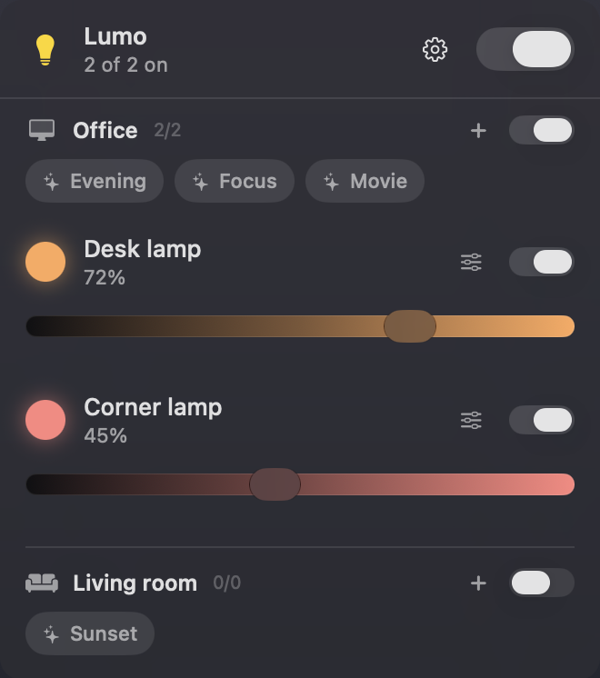
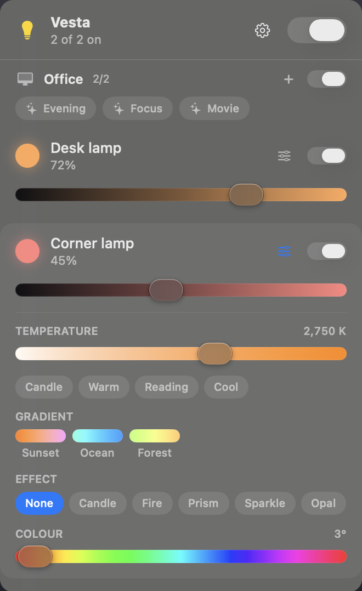
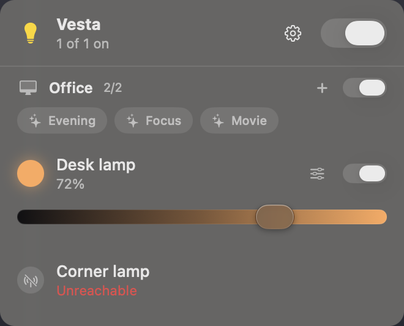
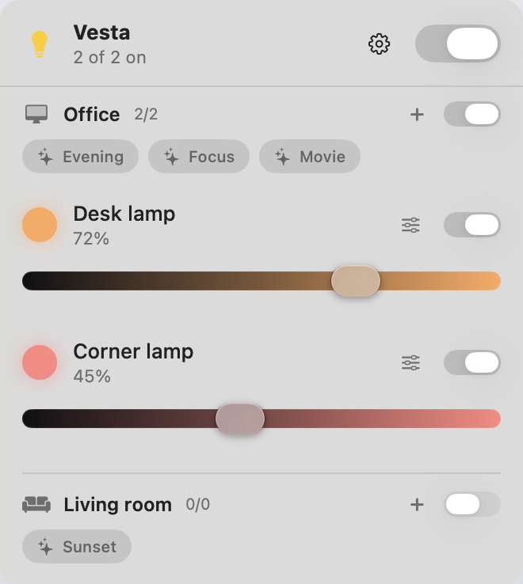

# Lumo

A macOS menu-bar controller for Philips Hue that talks only to your lights.

Smart-home software normally asks you to choose: a house full of useful technology,
or your privacy. Lumo does not make that trade. It speaks to the bridge on your own
network and to nothing else — no account, no cloud, no telemetry, no crash
reporting, no update check, no analytics. Nothing about your home leaves your
machine, including the fact that you are home.

It has **no third-party dependencies at all**. Apple frameworks only, so there is no
supply chain to audit and no package that can be compromised on your behalf. The
bridge connection is pinned to your bridge's own certificate, and its key is kept in
the Keychain.

These are checked, not claimed: CI fails the build if a hard-coded host appears in
the source, if a network API is used outside the reviewed transport, or if a remote
package is declared. See [SECURITY.md](SECURITY.md) and
[CONSTITUTION.md](CONSTITUTION.md).

Rooms, scenes, per-light colour and brightness, gradients and effects — from the
menu bar.

<p align="center">
  
  &nbsp;&nbsp;
  
</p>
<p align="center">
  
  &nbsp;&nbsp;
  
</p>

## Requirements

- macOS 14 or later
- A Philips Hue Bridge on the same network
- Xcode to build (not just Command Line Tools — SwiftUI's `@State` is a macro whose
  plugin ships inside Xcode). `build.sh` selects a toolchain via `DEVELOPER_DIR`.

## Build

Run once, to create a stable self-signed identity in the login keychain:

```bash
./tools/make-signing-identity.sh
```

Without it, `build.sh` signs ad-hoc; the hash changes every rebuild, so macOS treats
each build as a new app and re-prompts for Keychain access to the bridge key.

```bash
./build.sh && open build/Lumo.app
```

### Two build variants

Liquid Glass comes from the deployment target, not from calling `glassEffect`.
Building against macOS 26 restyles the popover chrome and every standard control, so
one binary cannot show both looks. The target is a build parameter over one source
tree:

```bash
./build.sh                          # macOS 26 — Liquid Glass
LUMO_MACOS_TARGET=14.0 ./build.sh   # macOS 14 — classic appearance
```

`Package.swift` defines `LUMO_GLASS` only for a macOS 26+ target, because
`glassEffect` must exist at compile time — `if #available` is not sufficient. Code
using it is guarded by `#if LUMO_GLASS`.

## Bridge setup

Pairing requires a physical button press. Run this, then press the round button on
the bridge within 60 seconds. Launch via `open -n` so the local-network permission
prompt attaches to the app rather than the calling shell:

```bash
open -n -W build/Lumo.app --args --pair-bridge <bridge-ip>
```

The application key is stored in the Keychain, never on disk. Every later connection
is pinned to the bridge's certificate, whose common name is the bridge ID.

CLI output goes to `~/Library/Containers/dev.lumo.Lumo/Data/lumo-cli.log`, because
`open` detaches stdout.

| Command | Purpose |
|---|---|
| `--pair-bridge <ip>` | Pair with a bridge |
| `--verify-bridge` | List every light the bridge reports |
| `--test-lights` | Flash each light, restoring its prior state |
| `--discover` | Report how Lumo would locate the bridge |
| `--test-relocate <ip>` | Poison the stored address and confirm recovery |
| `--make-presets "<room>"` | Create Evening, Reading and Candlelight scenes |
| `--diagnose` | Print a health report; non-zero exit when something is wrong |

### DHCP lease changes

Lumo stores the bridge's mDNS name (`aabbcc112233.local`), derived from its ID by
removing the `fffe` EUI-64 padding, so the address follows the device. When a request
fails in a way that indicates a bad address, the transport re-homes to that name,
replays the request once, and writes the working address back to the Keychain.

## Features

**Rooms** come from the bridge, matching the Hue app and any wall switch. Each room
has its own switch — one `grouped_light` call, so the room switches at once — and its
own scenes.

**Scenes are real Hue scenes**, including those created in the Hue app. Recalling one
is a single request the bridge executes. Saving creates a genuine Hue scene in that
room. Only scenes Lumo created are offered for deletion, since a scene made elsewhere
may be wired to a routine or a switch.

Rapid scene switching is coalesced: Hue applies a scene as a transition, and
recalling a second scene mid-transition leaves lamps at intermediate values. Only the
last scene in a burst is sent.

**Per light**, read from the bridge rather than hard-coded:

- Brightness, with the track tinted the colour that light is emitting
- Colour temperature with a live Kelvin readout and presets (candle, warm, reading,
  cool). On a gradient fixture, writing a colour temperature is also what clears the
  gradient and returns the lamp to flat light.
- Gradient palettes for fixtures that support them, such as the Play lamps (5 colour
  points across 8 pixels). Only genuinely multi-colour looks appear; a uniform
  gradient is indistinguishable from a flat colour.
- The bridge's built-in effects: candle, fire, prism, sparkle, opal, glisten,
  underwater, cosmos, sunbeam, enchant.

A scene chip is ticked when the room currently matches that scene; a temperature
preset is outlined when the light sits on it. An unreachable light is shown
distinctly from one that is off.

The popover sizes to its content, up to the space below the menu bar. There is no
resize handle: menu-bar popovers on macOS are not resizable.

### Transports

| Mode | State |
|---|---|
| Bridge | Rooms, scenes, per-light control. The default once paired. |
| Bluetooth | Implemented and working against unbonded bulbs, but unavailable while the Hue app holds the bond. |

A Hue bulb accepts control from one bonded controller. Where the Hue app has already
bonded with a bulb, it keeps that bond: macOS is not offered a pairing exchange, and
every write is refused with `Encryption is insufficient`. This is a property of the
bulbs, not a gap in the transport — `Sources/LumoBLE` implements the full control
service and drives a bulb that is free to bond.

The bridge is the better path regardless: no bond, no range limit, no ten-bulb
ceiling, and it reports changes made from anywhere, including the Hue app and wall
switches.

`SimulatedTransport` backs the tests and the snapshot renderer. It is not
user-selectable.

## Development

```bash
DEVELOPER_DIR=/Applications/Xcode-beta.app/Contents/Developer swift test
```

CI builds both variants, runs the tests, and runs `tools/check-boundaries.sh` and
`tools/check-no-secrets.sh` on every push.

Contract tests in `Tests/LumoBridgeTests` decode recorded bridge responses. The
bridge is third-party firmware whose payload shape changes without notice, so the
fixtures cover the parts most likely to shift: partial events, rooms listing devices
rather than lights, `status.active`, and gradient point counts. They need no
hardware.

The hardware suite needs a bridge on the network: `--verify-bridge`, `--test-lights`,
`--test-scene-switch`, `--test-relocate`, `--test-scenes`.

### Snapshots

Renders the popover in every interesting state, light and dark, to PNG. Run the
unsandboxed binary from `.build`; the signed bundle cannot write outside its
container.

```bash
.build/release/Lumo --snapshot /tmp/lumo-shots
```

Capturing Liquid Glass requires Screen Recording permission: glass is composited by
the window server, so nothing drawn in-process can see it. Grant it under System
Settings > Privacy & Security > Screen & System Audio Recording. Without it the run
still produces images, using the classic fallback and printing `Liquid Glass MISSING`
for each file.

Shots are taken in the popover's own material over a fixed neutral gradient, so they
show the app's real translucency and stay identical run to run.
`LUMO_SNAPSHOT_BACKDROP=desktop` uses the actual wallpaper instead — for local
inspection only, never for anything committed.

## Diagnostics

Lumo sends no telemetry, so diagnostics are produced after the fact.

**Copy Diagnostics** in the gear menu puts a health report on the clipboard: build
and OS versions, which appearance the binary targets, bridge address and key
fingerprint, time since the last sync and last pushed event, and counts of lights,
rooms and scenes. It contains no light, room or scene names — reports get pasted in
public.

**Logs** go to the unified log under subsystem `dev.lumo.Lumo`, categories
`transport`, `store`, `ui` and `setup`. Names are logged `%{private}` and redacted.

```bash
log show --predicate 'subsystem == "dev.lumo.Lumo"' --last 1h --info --debug
```

Every failure path reports through `LightStore.report`, which logs it and raises a
banner in the popover.

## Layout

```
Sources/LumoKit    domain model, LightTransport, SimulatedTransport, scenes
Sources/LumoBLE    the only target that imports CoreBluetooth
Sources/LumoBridge Hue Bridge over the local CLIP v2 API
Sources/Lumo       menu-bar app, plus the offscreen snapshot renderer
```

`LightTransport` is the seam between the domain model and any particular protocol.

The menu bar item is an `NSStatusItem` with an `NSPopover`, not SwiftUI's
`MenuBarExtra`. `MenuBarExtra(.window)` does not keep its panel anchored to the status
item across content-size changes.

## Security

See [SECURITY.md](SECURITY.md) for the threat model and what holds today, and
[CONSTITUTION.md](CONSTITUTION.md) for the invariants and how they are enforced.

## Licence

MIT — see [LICENSE](LICENSE).
